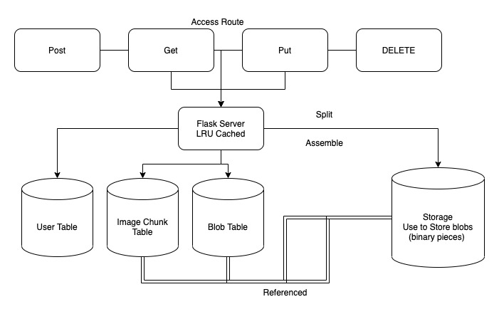

# ImageRepo

# Features and Challenges
 - Secured CURD operation using `jwt-token` to each protected API route
 - Optimized storing by split each image (file) into fixed size chunk and referenced using its sha256 hash
 - Deletion are managed by blobs manager (in case of same images, we only decrease count before do the actual deletion)
 - LRU cache used for faster transmission
 - Presitant Storage (via PostgreSQL), data is presitant even server reboot

# Backend Struture

# Running the database
 - `cd ./ImageRepo` 
 - `docker-compose up` (must have docker installed)

# Running the backend
 - Install required dependencies 
    `pip3 install -r requirements.txt`

 - Install database schema 
    Use the --reinstall-schema option to configure database.
    `python3 run_dev_server.py --reinstall-schema`

 - Start 
   `python3 run_dev_server.py `

# How to Use
 - Run Both Database and Backend localhost:5666
 - Use Postman or similiar app to communicate with the server

# Register User
 - `POST` to 'http://127.0.0.1:5666/register'
 - In Request Body, Include Following format as `JSON`
 - `
 {
  "name": "YOUR USERNAME",
  "password": PASSWORD,
  "email": EMAIL ADDR"
 }`

# Login User
- `POST` to 'http://127.0.0.1:5666/login'
- Include Following `JSON` Format
- `{
  "username": "2@umd.edu",
  "password": "123456"
  } ` 

- You will get an access_token

# Upload Image 
- `POST` to 'http://127.0.0.1:5666/images'
- Header: `Authorization: Bearer + " " + token`
- Body Type: `form-data`

- `{
    "file": ATTACHED YOUR IMAGE HERE (use postman build in function),
    "description": DESCRIPTION,
    "isPrivate": 0 or 1 (type `int`),
    "accessKey": ACCESSKEY 
    }`

- if success, you will see many binary file in `blobs` folder
- will return a response like below
- `{
    "accessKey": "0123",
    "creator": 2,
    "id": 8,
    "locked": true,
    "name": "Screen_Shot_2021-06-14_at_10.13.19_AM.png"
}`
- `id` is the image ID

# Get Image
- `GET` to `'http://127.0.0.1:5666/images/image_id' (image_id is a variable of type int)`
- Header: `Authorization: Bearer + " " + token`
- args: if you are `not` the creator, and the image is private, then you need to provide `accesskey` in params
- You will see your image in `outputs` directory

# Update image option (private/public)
- `PUT` to `'http://127.0.0.1:5666/images/image_id' (image_id is a variable of type int)`
- Header: `Authorization: Bearer + " " + token`
- Body `JSON` TYPE
- Example 
- `{
    "description":"des",
    "isPrivate": 0,
    "accessKey": "0000"
}`

# DELETE image 
- `DELETE` to `'http://127.0.0.1:5666/images/image_id' (image_id is a variable of type int)`
- Header: `Authorization: Bearer + " " + token`

# Test
 - Run 
   `python3 tests/apiTests/run_test.py `

